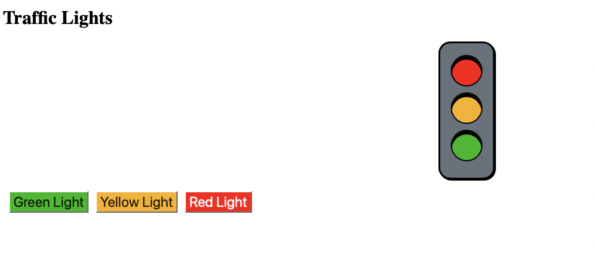

# Traffic Light Simulator 🚦

A modernized, interactive traffic light simulator built with HTML, CSS, and JavaScript. This project showcases a revamped user interface and improved code structure.

## Features

- **Interactive Controls:** Click buttons to change the traffic light state (Red, Yellow, Green).
- **Modern UI:** Clean and visually appealing design with smooth transitions.
- **Responsive Design:** Adapts to different screen sizes for a consistent experience on desktop and mobile devices.
- **Semantic HTML:** Structured with HTML5 semantic elements for better accessibility and SEO.
- **Efficient JavaScript:** Refactored JavaScript for better readability, maintainability, and performance, using event delegation.
- **CSS Enhancements:** Styled with Flexbox, custom properties (though not explicitly used in this version, good practice for future), and subtle animations/glow effects for active lights.

## Screenshots

**New Interface:**
*(Imagine a new screenshot here reflecting the updated UI. Since I cannot generate images, I'll describe it: The new screenshot would show the centered traffic light with larger, glowing lights, modern buttons below it, and the header/footer.)*

**Old Interface (for comparison):**


*(Ideally, you would replace the placeholder above with an actual screenshot of the new UI after running the application in a browser.)*

## How to Use

1. Clone the repository:
   ```bash
   git clone <repository-url>
   ```
2. Navigate to the project directory:
   ```bash
   cd trafficLights
   ```
3. Open `index.html` in your web browser.
4. Click the "Green Light", "Yellow Light", or "Red Light" buttons to control the traffic light.

## Project Structure

```
trafficLights/
├── assets/
│   ├── css/
│   │   └── styles.css      # Main stylesheet
│   └── js/
│       └── script.js       # JavaScript for interactivity
├── screenshot/
│   └── trafficLightIndex.png # Screenshot of the old UI
├── index.html              # Main HTML file
└── README.md               # This file
```

## Enhancements Made (Project Makeover)

- **HTML:** Restructured using semantic elements (`<header>`, `<main>`, `<nav>`, `<footer>`).
- **CSS:** Completely revamped for a modern look and feel, using Flexbox for layout, improved styling for lights and buttons, added transitions, and basic responsiveness.
- **JavaScript:**
    - Refactored for clarity and efficiency.
    - Implemented event delegation for button controls.
    - Lights are now controlled by adding/removing an `active` CSS class, allowing for more complex styling (like glow effects).
    - Improved initialization and DOMContentLoaded handling.
